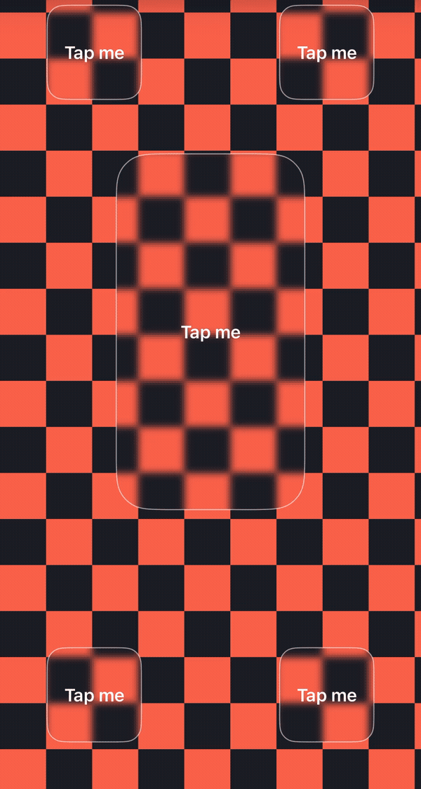
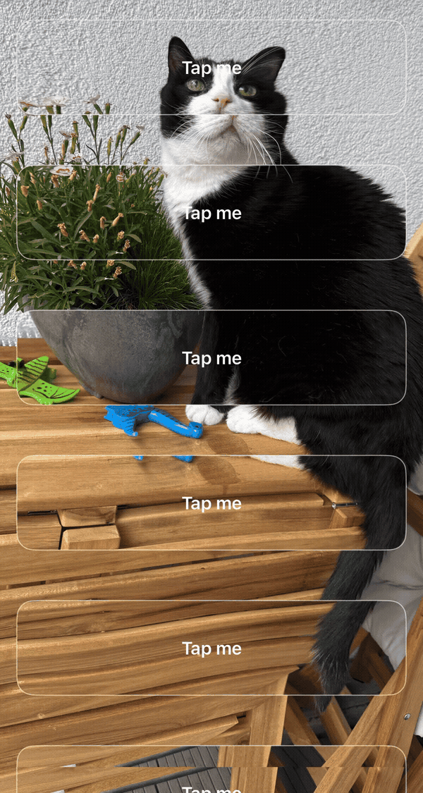

# Undertow

Live backdrop effects for SwiftUI — applied to scrolling, animating content, not static
snapshots, and revealed only behind the views you choose: a button, a bar, any view with a
transparent background.


<p float="left">
  
  
</p>

> GIF compression can't capture actual scroll smoothness — on device, scrolling feels no different
> with the effect running than over an empty background, and Instruments shows no added hitches.

## Features

- **Works across scrolling and animating content** — effects run on live content every render
  pass and stay pinned to their targets as content moves underneath
- **Masked to your views** — blur the background and it's only visible behind the views you mark
  as targets; targets must have a transparent background
- **Multiple simultaneous targets** — one effect source, any number of target views
- **Nine built-in effects** — [Gaussian blur](https://github.com/twostraws/Inferno#variable-blur),
  RGB inversion, [color planes](https://github.com/twostraws/Inferno#color-planes),
  [emboss](https://github.com/twostraws/Inferno#emboss),
  [water](https://github.com/twostraws/Inferno#water) and
  [wave](https://github.com/twostraws/Inferno#wave) distortion,
  [shimmer](https://github.com/twostraws/Inferno#shimmer),
  [white noise](https://github.com/twostraws/Inferno#white-noise), and
  [rainbow noise](https://github.com/twostraws/Inferno#rainbow-noise)
- **Simple three-piece API** — `effectSource()`, `effectTarget()`, `effectCoordinator()`

## Requirements

- iOS 18+
- Swift 6

## Installation

### Swift Package Manager

In Xcode: **File → Add Package Dependencies**

Enter the repository URL:
```
https://github.com/MaksimG82/Undertow
```

Or add directly to `Package.swift`:

```swift
dependencies: [
    .package(url: "https://github.com/MaksimG82/Undertow", from: "1.0.0")
]
```

## Quick Start

```swift
import Undertow

ZStack {
    scrollingBackground
        .effectSource(configuration: .gaussianBlur(radius: 10, maxSamples: 5))

    fixedPanel
        .effectTarget(cornerRadius: 16)
}
.effectCoordinator()
```

`effectCoordinator()` must wrap both the `effectSource()` and any `.effectTarget()` views for
the environment plumbing to connect them.

## How it works

`effectSource()` renders its content twice, stacked in a `ZStack`: once as-is, and once with the
shader effect applied, masked to the frames of any `.effectTarget()` views nearby.

Each target reports its own frame and corner radius to the nearest `effectCoordinator()`, which
shares them with the source — that's what the coordinator is for. The effect only shows through
where a target sits, and stays pinned there as content scrolls underneath.

One source drives exactly one effect; running several effects at once means several independent
`effectSource()`/`effectTarget()`/`effectCoordinator()` groups.

## Effects

See the effect links above for a preview of each, or [`Effect`](https://MaksimG82.github.io/Undertow/documentation/undertow/effect)
for parameters.

## Adding your own effect

Every effect is a `.metal` shader plus a small `Effect` case and dispatch entry — the same shape
across all nine built-in effects. Fork the repo, add your shader alongside the existing ones,
compile it with `Scripts/compileShader.sh` (requires the Metal toolchain) to produce its two
`.metallib` files, and open a PR.

## Documentation

Full documentation is available at [MaksimG82.github.io/Undertow](https://MaksimG82.github.io/Undertow/documentation/undertow)

## Acknowledgments

The shader effects are based on [Inferno](https://github.com/twostraws/Inferno) by Paul Hudson —
an open-source collection of SwiftUI shaders and a great starting point if you want to learn how
they work.

## License

Undertow is available under the MIT license.
